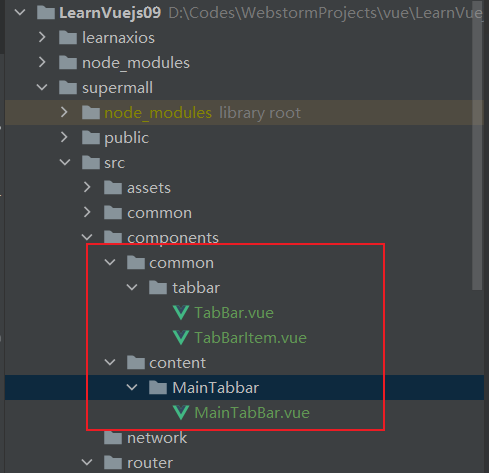
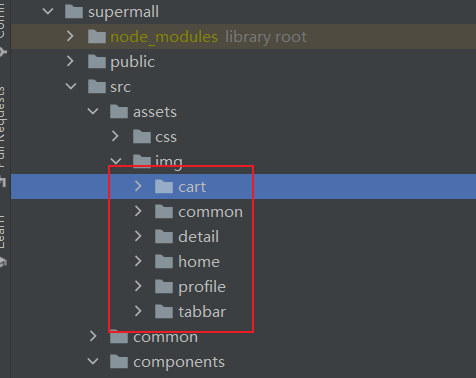
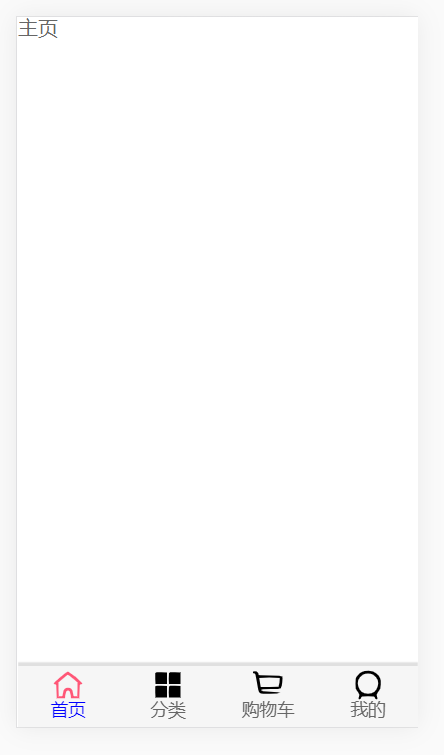
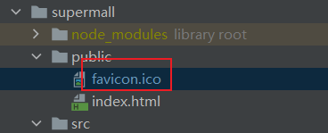

## 开发底部导航

1. 将之前开发的底部导航栏拷贝过来放入到src-> components中



2. 然后将图片拷贝过来



3. 修改`MainTabBar.vue`中图片路径

```vue
<!--...省略代码...-->
<tab-bar-item path="/home" activityColor="blue">
    
    
    <div slot="item-text">首页</div>
</tab-bar-item>
<tab-bar-item path="/category" activityColor="red">
    
    
    <div slot="item-text">分类</div>
</tab-bar-item>
<tab-bar-item path="/cart" activityColor="green">
    
    
    <div slot="item-text">购物车</div>
</tab-bar-item>
<tab-bar-item path="/profile">
    
    
    <div slot="item-text">我的</div>
</tab-bar-item>
<!--...省略代码...-->
```

4. 将`MainTabBar.vue`注册到App.vue中

```vue
<template>
  <div id="app">
    <main-tab-bar></main-tab-bar>
  </div>
</template>

<script>
  import MainTabBar from "components/content/MainTabbar/MainTabBar";

  export default {
    name: 'app',
    components: {
      MainTabBar
    }
  }
</script>


<!--...省略代码...-->
```

会发现前端出错

5. 导入之前项目的views文件及router -> index.js文件中的部分内容


`index.js`

```js
// 懒加载
const Home = () => import('../views/home/Home')
const Category = () => import('../views/category/Category')
const Cart = () => import('../views/cart/Cart')
const Profile = () => import('../views/profile/Profile')

Vue.use(VueRouter)

const routes = [
  {
    path: '',
    redirect: '/home'
  },
  {
    path: '/home',
    component: Home
  },
  {
    path: '/category',
    component: Category
  },
  {
    path: '/cart',
    component: Cart
  },
  {
    path: '/profile',
    component: Profile
  }
]

const router = new VueRouter({
  routes,
  mode: 'history'
})
```

修改`MainTabBar`中导入模块路径，在路径中加入common

```vue
import TabBar from "components/common/tabbar/TabBar";
import TabBarItem from "components/common/tabbar/TabBarItem";
```

6. 启动项目，成功



6. 修改ICON

   复制文件到public-文件下就行了



