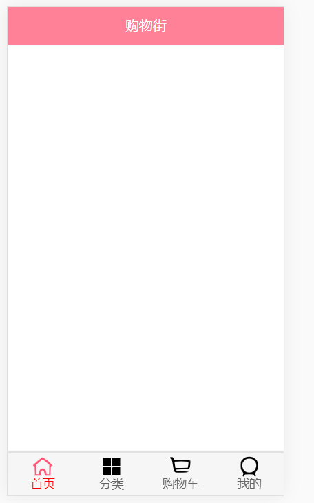

## 封装顶部导航

1. 在components-> common中创建文件夹navBar并创建NavBar.vue

```vue
<template>
  <div class="nav-bar">
    <div class="left">
      <slot name="left"></slot>
    </div>

    <div class="center">
      <slot name="center"></slot>
    </div>

    <div class="right">
      <slot name="right"></slot>
    </div>
  </div>
</template>

<script>
export default {
  name: "NavBar"
}
</script>

<style scoped>
  .nav-bar {
    display: flex;
    height: 44px;
    line-height: 44px;
    text-align: center;
    box-shadow: 0 1px 1px rgba(100,100,100,0.1);
  }

  .left {
    width: 60px;
  }
  .center {
    flex: 1;
  }

  .right {
    width: 60px;
  }

</style>

```

在Home.vue引用NavBar并在插槽center中插入内容

```vue
<template>
	<div id="home">
        <nav-bar class="home-nav">
          <div slot="center">购物街</div>
        </nav-bar>
    </div>
</template>

<script>
    import NavBar from "components/common/navBar/NavBar";
    
    export default {
    name: "Home",
    components: {
      NavBar,
    }
</script>
<!-- 指定顶部背景颜色 -->
<style scoped>
  .home-nav{
    background-color: var(--color-tint);
    color: #fff;
  }
</style>

```

