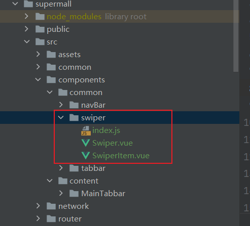

修改顶部轮播图

1. 导入老师给的Swiper文件



2. 在src->home下创建childComps文件夹，并创建HomeSwiper.vue文件

   并通过props接收Home传来的数组

```vue
<template>
  <swiper>
    <swiper-item v-for="item in banners">
      <a :href="item.link">
        
      </a>
    </swiper-item>
  </swiper>
</template>

<script>
  import {Swiper, SwiperItem} from "components/common/swiper"
export default {
  name: "HomeSwiper",
  components: {
    Swiper,
    SwiperItem
  },
  props: {
    banners: {
      type: Array,
      default() {
        return []
      }
    }

  }
}
</script>

<style scoped>

</style>
```

3. 在Home.vue中使用`HomeSwiper.vue`并传入参数

```vue
<template>
  <div id="home">
    <nav-bar class="home-nav">
      <div slot="center">购物街</div>
    </nav-bar>
    <home-swiper :banners="banners"></home-swiper>
  </div>
</template>

<script>
  import NavBar from "components/common/navBar/NavBar";
  import HomeSwiper from "./childComps/HomeSwiper";

  import { getHomeMultidata } from "network/home";

  export default {
    name: "Home",
    components: {
      NavBar,
      HomeSwiper,
      HomeRecommendView,
    },
    /*...代码...*/
</script>
```

通过 `:banners="banners"` 的形式将子组件中的banners绑定到Home中的banners


